# FIAP - Faculdade de Informática e Administração Paulista

<p align="center">
<a href= "https://www.fiap.com.br/"></a>
</p>

<br>

# Fase 4 - Cap 1 - Visão Computacional na Clínica

## Autor: 
- <a href="https://www.linkedin.com/in/renanmendes26/">Renan de Oliveira Mendes - RM563145</a>


# Descrição
Nessa quarta fase aprofundamos em visão computacional, por meio de modelos de redes neurais convulacionais CNNs.

Indo além, criei uma interface moderna com React Native para dispositivos mobiles. 

## Links Videos:
### Parte 1 e Parte 2: 
### Ir Além: https://youtu.be/1NBNX88V1-0
### App: https://youtube.com/shorts/XTpQ_kAq_G8


# Parte 1
Usando o dataset "Chest X-Ray Images (Pneumonia)" com mais de cinco mil imagens, criei um pipeline onde realizei técnicas de pré-processamento, como redimensionamento, normalização e data augmentation.

dataset: https://www.kaggle.com/datasets/paultimothymooney/chest-xray-pneumonia

O dataset Chest X-Ray Pneumonia disponível publicamente no Kaggle. O conjunto contém imagens classificadas em duas categorias:

- Normal
- Pneumonia

As imagens já se encontram separadas em conjuntos de treinamento, validação e teste.

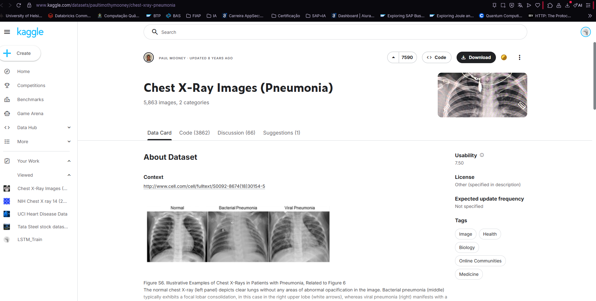
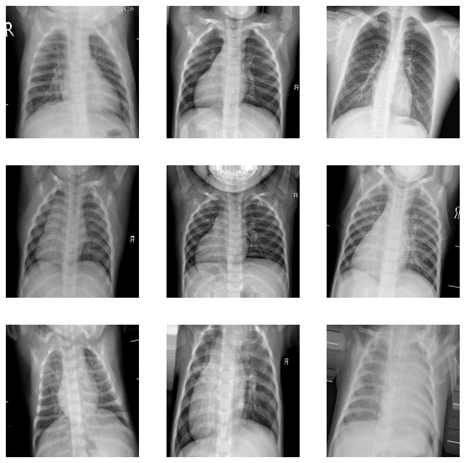


Para Pré-Processamento as etapas realizadas foram:

- Redimensionamento das imagens para 128 pixels.
- Normalização dos pixels para o intervalo entre 0 e 1.
- Aplicação de técnicas de aumento de dados (rotação, zoom e espelhamento horizontal).
- Organização dos dados em conjuntos de treinamento, validação e teste.


Redimensionei as imagens para escalas de (128,128) para facilitar o treinamento, diminuindo as escalas. A normalização acelera o treinamento e melhora a convergência. O aumento de dados reduz overfitting e melhora a capacidade de generalização do modelo.

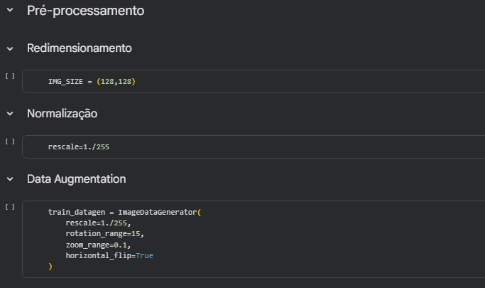


Durante a análise do dataset foi identificado um desbalanceamento entre as classes. O conjunto de treinamento contém 1.341 imagens classificadas como Normal e 3.875 imagens classificadas como Pneumonia. Esse cenário pode introduzir viés no treinamento do modelo, favorecendo a classe majoritária. Para mitigar esse problema foi usada técnicas como data augmentation e ponderação de classes durante o treinamento.


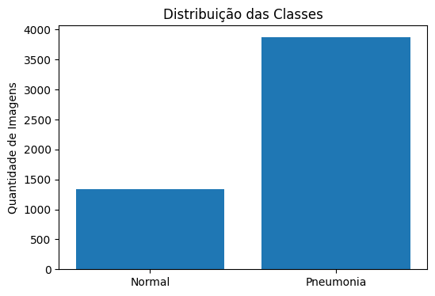

# Parte 2

Seguindo, no mesmo notebook python realizamos as seguintes etapas:

- Treinamento de uma CNN simples.
- Treinamento de uma CNN com Transfer Learning.
- Comparação dos resultados.
- Interface para classificação.

Foram implementadas duas abordagens para classificação de imagens médicas: uma CNN construída do zero e um modelo de transfer learning utilizando MobileNetV2.

O modelo CNN desenvolvido do zero possui 3.304.769 parâmetros distribuídos em 10 camadas. É composto por três camadas convolucionais (Conv2D) para extração de características, três camadas de Max Pooling para redução da dimensionalidade, uma camada Flatten para transformar em um vetor unidimensional, uma camada Dropout para reduzir o risco de overfitting e duas camadas densas (Dense) responsáveis pela classificação final. As funções de ativação utilizadas foram ReLU e Sigmoid na camada de saída, usadas para problemas de classificação binária.

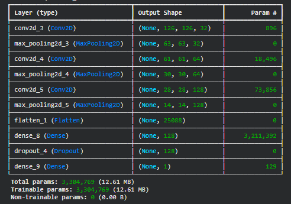

O modelo MobileNetV2 foi escolhido por apresentar uma arquitetura mais leve em comparação com outros modelos utilizados em Transfer Learning, como VGG16 e ResNet. 
Apesar de possuir aproximadamente 3,5 milhões de parâmetros, esse número é menor do que o de arquiteturas mais complexas, permitindo tempos de treinamento reduzidos, além de menor consumo de memória. Essas características tornam o modelo especialmente adequado para aplicações com recursos computacionais limitados e para protótipos que exigem boa precisão aliada a desempenho eficiente.


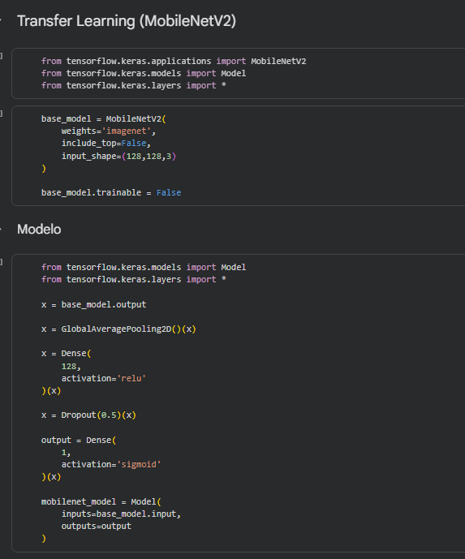

 Devido ao desbalanceamento do dataset (25,71% Normal e 74,29% Pneumonia), foi aplicada ponderação de classes durante o treinamento. 


### Análise das Métricas

Foram avaliadas duas abordagens para a classificação das imagens médicas: uma CNN desenvolvida do zero e um modelo baseado em Transfer Learning com MobileNetV2. Os resultados obtidos são apresentados na tabela abaixo:

|Modelo	|Accuracy|	Precision|	Recall|	F1-Score|
|------|--------|-------|--------|--------|
|**CNN**|87,02%|	85,19%|	95,90%| 90,23%|
|**MobileNetV2** |79,97% |96,82% |70,26% |81,43%|


A CNN apresentou o melhor desempenho geral entre os modelos avaliados, alcançando 87,02% de acurácia e 90,23% de F1-Score. O modelo também obteve um recall de 95,90%, indicando elevada capacidade de identificar corretamente os casos de pneumonia.

Em aplicações médicas, o recall é uma métrica importante, pois reduz a ocorrência de falsos negativos, ou seja, casos em que pacientes com a doença seriam classificados como saudáveis. Embora a precisão tenha sido um pouco menor (85,19%), o modelo demonstrou um equilíbrio adequado entre identificação de casos positivos e confiabilidade das previsões.


O MobileNetV2 apresentou comportamento diferente. Sua principal característica foi a alta precisão de 96,82%, indicando que quando o modelo prevê pneumonia, a probabilidade de essa classificação estar correta é muito elevada.

Por outro lado, o modelo obteve um recall de apenas 70,26%, demonstrando dificuldade em identificar todos os casos positivos presentes no conjunto de teste. Isso significa que uma parcela considerável dos pacientes com pneumonia não foi detectada pelo modelo, aumentando a quantidade de falsos negativos.

Como consequência, a acurácia geral (79,97%) e o F1-Score (81,43%) ficaram abaixo dos resultados obtidos pela CNN.

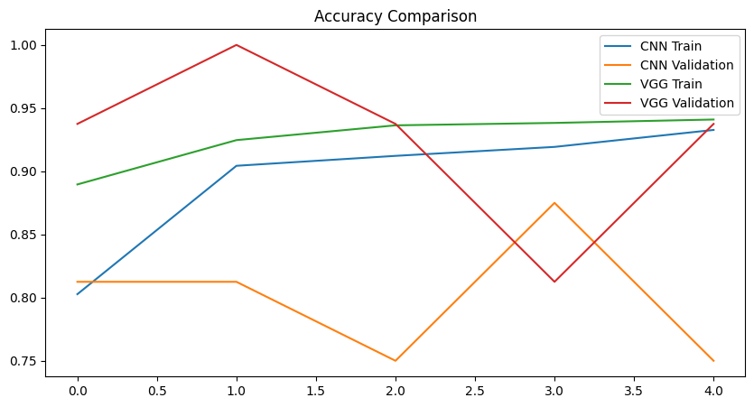

Cada modelo apresentou pontos fortes distintos:

- CNN: maior acurácia, maior recall e melhor F1-Score.
- MobileNetV2: maior precisão.
- CNN: melhor equilíbrio entre sensibilidade e desempenho geral.
- MobileNetV2: classificações positivas mais conservadoras e confiáveis.

Embora modelos de Transfer Learning frequentemente apresentem desempenho superior em tarefas de visão computacional, neste treinamento a CNN obteve os melhores resultados, superando o MobileNetV2 em acurácia, recall e F1-Score. Isso se deve ao tempo de epócas reduzidos de treinamento.

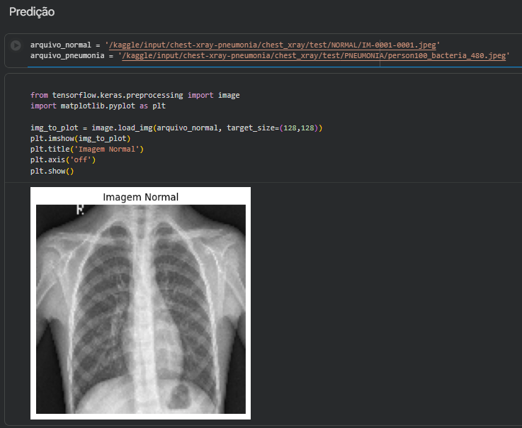


# Ir Além

Nessa etapa fiz uma análise de vieses do dataset. Expliquei o desbalanceamento de classes, também analisei a falta de informações referente a politicas legais, populacionais e éticas dos dados. Explico o uso do class weight e sugiro outras formas de mitigação. 


# Ir Além 2

Indo além desenvolvi um assistente de detecção de pneumonia, usando API Flask e Exp Go - React Native, criei a interface do app mobile.

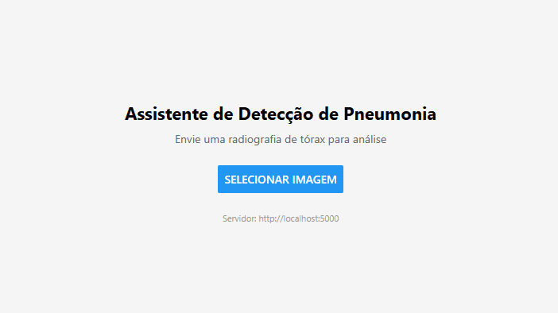

O assistente roda o modelo do MobileNet, pois apresentou melhores resultados ao identificar casos positivos, o que é essencial para modelos na área da saúde.

A aplicação permite o usuário enviar uma imagem de raio-x do toráx, aciona o modelo treinado por meio de APIs e retorna a classificação, discriminando entre duas categorias "Normal" ou "Penumonia"
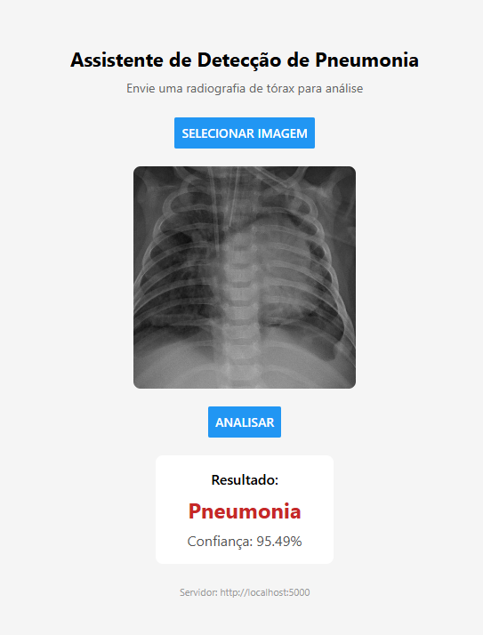

A aplicação roda nativamente no celular de forma responsiva.

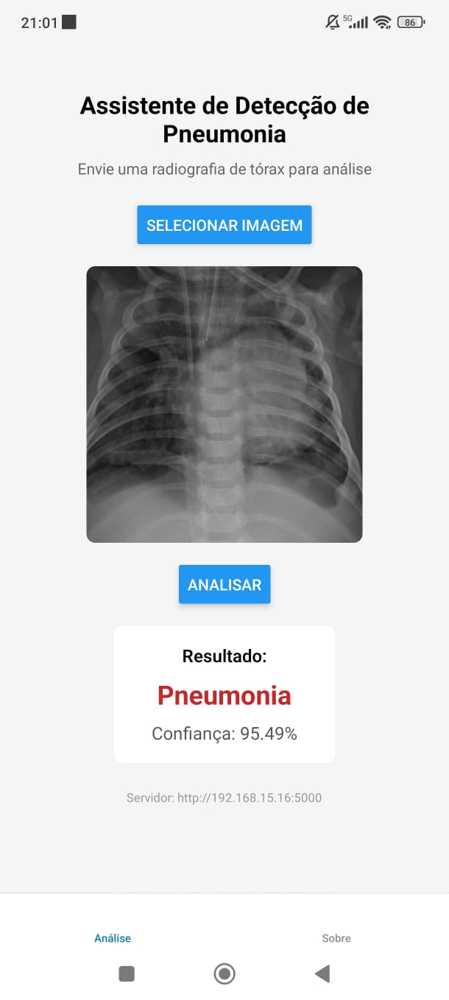

### App: https://youtube.com/shorts/XTpQ_kAq_G8

Aplicação composta por:
- **backend/** — API Flask com modelo MobileNet (TensorFlow/Keras)
- **cardio-assistant/** — App mobile/web com Expo (React Native)

### Pré-requisitos

- Python 3.10+ (venv já incluído em `venv/`)
- Node.js 18+
- [Expo Go](https://expo.dev/go) no celular **ou** emulador Android/iOS

---

### 1. Iniciar o backend (API)

Abra um terminal na pasta do projeto:

```powershell
cd "c:\Users\Pichau\OneDrive\Área de Trabalho\Fase_4_Cap1\Ir_Alem2\backend"
```

Ative o ambiente virtual e inicie o servidor:

```powershell
..\venv\Scripts\Activate.ps1
python app.py
```

O servidor ficará disponível em `http://localhost:5000`.

Teste rápido no navegador ou PowerShell:

```powershell
Invoke-RestMethod http://localhost:5000/health
```

Deve retornar: `{"status":"ok","model":"mobilenet_pneumonia.keras"}`

---

### 2. Iniciar o app (Expo)

Abra **outro terminal**:

```powershell
cd "c:\Users\Pichau\OneDrive\Área de Trabalho\Fase_4_Cap1\Ir_Alem2\cardio-assistant"
npm install
npx expo start
```

Opções após o Expo iniciar:

| Plataforma | Como abrir |
|------------|------------|
| **Web** | Pressione `w` no terminal |
| **Android emulador** | Pressione `a` (requer Android Studio) |
| **Celular físico** | Escaneie o QR code com Expo Go |

---

### 3. Configurar URL do servidor

O app detecta automaticamente:

| Ambiente | URL padrão |
|----------|------------|
| Web / iOS simulador | `http://localhost:5000` |
| Emulador Android | `http://10.0.2.2:5000` |
| Celular físico | Precisa do IP da sua máquina na rede Wi-Fi |


### Fluxo de uso

1. Backend rodando (`python app.py`)
2. App aberto no Expo
3. Aba **Análise** → **Selecionar Imagem** → **Analisar**
4. Resultado: `Normal` ou `Pneumonia` + confiança (%)

---


### Estrutura

```
Ir_Alem2/
├── backend/
│   ├── app.py
│   ├── mobilenet_pneumonia.keras
│   └── requirements.txt
├── cardio-assistant/
│   ├── app/              # Rotas Expo Router
│   ├── screens/          # Tela principal de análise
│   └── constants/api.ts  # URL da API
└── venv/                 # Ambiente Python
```


# 📁 Estrutura de pastas

Dentre os arquivos e pastas presentes na raiz do projeto, definem-se:

- <b>assets</b>: Imagens relevantes para documentação desse repositório.

- <b>Ir_Alem</b>: Relatório de análise de ética do dataset e dos modelos.

- <b>Ir_Alem_2</b>: código da aplicação mobile.

- <b>Parte1e2</b>: Arquivo notebook python com as etapas de tratamento e treinamento dos modelos, CNN e de Transfer Learning.

  


